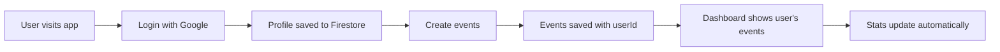

# EventHub – Event Management Web App

EventHub is a modern event management web application that allows users to securely create, view, and manage their personal events through a clean, dashboard-style interface. The application focuses on simplicity, real data, and a professional SaaS-like user experience.

---

## 🚀 Live Demo

👉 **Live URL:** [Add your deployed link here]  
👉 **GitHub Repo:** [Current Repository]

---

## 🧠 What This App Does (In Simple Terms)

EventHub acts as a **personal event organizer**.

A user can:
- ✅ Sign in securely using Google
- ✅ Create events with title, date, time, location, and description
- ✅ View all their created events in a dashboard
- ✅ Filter events by status (All, Upcoming, Completed, Draft)
- ✅ See real-time statistics about their activity

**All data is user-specific and private.**

---

## 🧩 Core Features

### 🔐 Authentication
- Google Sign-In using Firebase Authentication
- Secure, user-specific access
- Automatic user profile creation in Firestore

### 📝 Event Creation
Create events with:
- Event Title & Description
- Date, Time & Duration
- Location
- Guest invitations (via email)
- Notification preferences (Email/Slack)
- Reminder settings

Events are linked to the logged-in user and timestamped using Firestore server time.

### 📊 Events Dashboard
- Modern, light-themed UI with "1.ook" branding
- Card-based events listing with images
- Filter tabs: **All | Upcoming | Completed | Draft**
- Displays event title, date, time, and location
- Clean empty state when no events exist

### 📈 Real-Time Dashboard Stats
| Metric | Description |
|--------|-------------|
| **Total Events Created** | Count of all user's events |
| **Events This Month** | Events created in current calendar month |
| **Latest Event Created** | Date of most recent event |
| **Member Since** | User's account creation date |

> ⚡ All stats are calculated dynamically from Firestore — **no fake numbers!**

### 🎨 UI / UX
- Fully responsive (mobile, tablet, desktop)
- Light, premium SaaS-style design
- Built entirely with Tailwind CSS
- Consistent navigation across all pages
- User profile dropdown with sign-out option

---

## 🛠️ Tech Stack

| Technology | Purpose |
|------------|---------|
| **Next.js 15** | Frontend Framework (App Router) |
| **React 19** | UI Library |
| **Tailwind CSS** | Styling |
| **Firebase Auth** | Google Authentication |
| **Firebase Firestore** | NoSQL Database |
| **Vercel** | Deployment |

---

## 🗂️ Firestore Data Structure

### Users Collection
```
users/
  {userId}/
    uid: string
    firstName: string
    lastName: string
    email: string
    photoURL: string
    createdAt: timestamp
    lastLoginAt: timestamp
```

### Events Collection
```
events/
  {eventId}/
    title: string
    description: string
    date: string
    time: string
    duration: string
    location: string
    guests: array
    notification: string
    reminder: string
    userId: string
    createdAt: timestamp
```

---

## 🔑 Environment Variables

Create a `.env.local` file in the project root:

```env
NEXT_PUBLIC_FIREBASE_API_KEY=your_api_key
NEXT_PUBLIC_FIREBASE_AUTH_DOMAIN=your_project.firebaseapp.com
NEXT_PUBLIC_FIREBASE_PROJECT_ID=your_project_id
NEXT_PUBLIC_FIREBASE_STORAGE_BUCKET=your_project.appspot.com
NEXT_PUBLIC_FIREBASE_MESSAGING_SENDER_ID=your_sender_id
NEXT_PUBLIC_FIREBASE_APP_ID=your_app_id
```

> ⚠️ **Never commit `.env.local` to GitHub.**

---

## 🧪 Local Setup Instructions

1. **Clone the repository**
   ```bash
   git clone https://github.com/your-username/eventhub.git
   cd eventhub
   ```

2. **Install dependencies**
   ```bash
   npm install
   ```

3. **Add environment variables**
   - Create `.env.local` file
   - Add your Firebase configuration

4. **Run the development server**
   ```bash
   npm run dev
   ```

5. **Open in browser**
   ```
   http://localhost:3000
   ```

---

## 🔍 How the App Works (Flow)



1. User logs in with Google
2. User profile is stored in Firestore
3. User creates events with all details
4. Events are saved and linked to the user
5. Events page fetches and displays only the user's events
6. Dashboard stats update automatically based on Firestore data

---

## 📁 Project Structure

```
event-app/
├── src/
│   ├── app/
│   │   ├── page.js          # Event creation page
│   │   ├── events/page.js   # Events dashboard
│   │   ├── login/page.js    # Login page
│   │   ├── about/page.js    # About page
│   │   ├── community/page.js # Community page
│   │   └── layout.js        # Root layout
│   ├── components/
│   │   ├── UserMenu.jsx     # Profile dropdown
│   │   ├── StatsCard.jsx    # Dashboard stat cards
│   │   └── ...
│   ├── context/
│   │   └── AuthContext.jsx  # Authentication provider
│   └── lib/
│       ├── firebase.js      # Firebase configuration
│       ├── eventService.js  # Event CRUD operations
│       └── statsService.js  # Dashboard statistics
├── public/
├── .env.local               # Environment variables
└── package.json
```

---

## 🧠 Design Decisions

| Decision | Rationale |
|----------|-----------|
| **User-specific data only** | No public or marketplace events for simplicity |
| **No fake metrics** | All dashboard numbers are computed from real data |
| **Simple but scalable** | Architecture supports future enhancements |
| **Light theme** | Professional, accessible, modern aesthetic |
| **Status-based filters** | Real-world event management pattern |

---

## 🧑💼 Interview-Ready Project Summary

> EventHub is a personal event management application that demonstrates **authentication**, **Firestore data modeling**, **CRUD operations**, and **modern UI design**. The project focuses on **real data**, **clean UX**, and **scalable architecture** rather than over-engineering.

**Key Technical Highlights:**
- Firebase Authentication with Google provider
- Firestore database with user-scoped queries
- Real-time statistics computed from database
- Responsive design with Tailwind CSS
- Next.js App Router with client components
- Context API for state management

---

## 🚧 Possible Future Enhancements

- [ ] Edit & delete events (full CRUD)
- [ ] Event details page
- [ ] Search functionality
- [ ] Realtime updates with Firestore listeners
- [ ] User profile page
- [ ] Event sharing/collaboration
- [ ] Calendar view integration
- [ ] Email notifications via Firebase Functions

---

## 📸 Screenshots

| Login Page | Events Dashboard |
|------------|------------------|
|  |  |

| Event Creation | User Menu |
|----------------|-----------|
|  |  |

---

## 📄 License

This project is for **learning and portfolio purposes**.

---

## 👨‍💻 Author

**Jaiprakash Sahu**  
📧 jaiprakashsahu058@gmail.com

---

<p align="center">
  Made with ❤️ using Next.js, Firebase & Tailwind CSS
</p>
